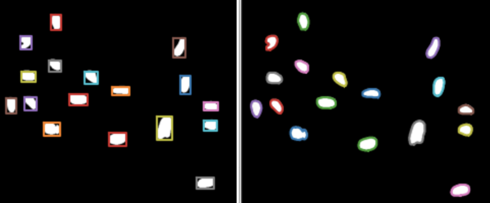

# Ome-to-microjson-plugin(0.1.7-dev0)

This plugin generates polygon coordinates (rectangle or encoding) for objects in binary or label images and extracts Nyxus features for each object, saving them in a JSON-based format using the [MICROJSON](https://github.com/bengtl/microjson/tree/dev) Python library. The output can be visualized in the [RENDER UI](https://render.ci.ncats.io/?imageUrl=https://files.scb-ncats.io/pyramids/Idr0033/precompute/41744/x(00-15)_y(01-24)_p0(1-9)_c(1-5)/) application, enabling overlay of segmentation encodings on microscopy images

Currently this plugin supports two Polygon types
1. rectangle
2. encoding
By default, this plugin uses `encoding` to compute polygon coordinates if `polygonType` is not defined.
`rectangle` polygon is bounding box coordinates, which surrounds each object and specifies its position.
`encoding` polygon is contour-based encoding, object boundries are represented as a series of connected line segements or curves.

## Examples



**a -** Example of Rectangle Polygon
**b -** Example of Encoding Polygon

Contact [Hamdah Shafqat Abbasi](mailto:hamdahshafqat.abbasi@nih.gov) for more information.
For more information on WIPP, visit the
[official WIPP page](https://isg.nist.gov/deepzoomweb/software/wipp).


## Building

To build the Docker image for the conversion plugin, run
`./build-docker.sh`.

## Install WIPP Plugin

If WIPP is running, navigate to the plugins page and add a new plugin. Paste the
contents of `plugin.json` into the pop-up window and submit.

## Options

This plugin can take four input arguments and one output argument:

| Name              | Description                                           | I/O    | Type         |
|-------------------|-------------------------------------------------------|--------|--------------|
| `intDir`          | Input directory containing intensity images                                     | Input  | string         |
| `segpDir`          | Input directory containing binary or label images                                      | Input  | string         |
| `filePattern`     | Pattern to parse image filenames                    | Input  | string       |
| `polygonType`            | Polygon type (rectangle, encoding)                        | Input  | enum       |
| `features`            | [Nyxus Features](https://pypi.org/project/nyxus/)                       | Input  | string      |
| `neighborDist`            | Distance between two neighbor objects                        | Input  | integer       |
| `pixelPerMicron`            | Pixel Size in micrometer                        | Input  | float       |
| `outDir`          | Output directory                        | Output | string       |
| `preview`      | Generate a JSON file with outputs                     | Output | JSON            |

## Run the plugin

### Run the Docker Container

```bash
docker run -v /data:/data polusai/ome-to-microjson-tool:0.1.7-dev0 \
  --intDir /data/input \
  --segDir /data/segmentations \
  --filePattern "x{x:d+}_y{y:d+}_p{p:d+}_c{c:d+}.ome.tif" \
  --polygonType "encoding" \
  --features "ALL" \
  --neighborDist 5.0 \
  --polygonType "encoding" \
   --pixelPerMicron 1.0 \
  --outDir /data/output \
  --tileJson

```
